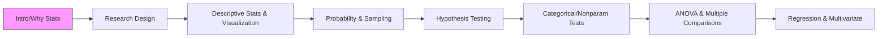

# Behavioral Research Statistical Methods (BRSM) – Comprehensive Syllabus Summary

**Executive Summary:** The BRSM course (“Behavioral Research: Statistical Methods”) covers statistical techniques and research design used in behavioral sciences. It includes foundational concepts (measurement scales, distributions), descriptive statistics, inferential methods (hypothesis testing, confidence intervals), specialized techniques (ANOVA, regression, PCA), and nonparametric/categorical tests. The syllabus comprises lecture modules, hands-on assignments (e.g., regression assignment), and illustrations. Key deliverables include at least one regression assignment (15 marks). *Learning outcomes* focus on understanding measurement validity, data visualization, sampling/inference, test selection, and analysis competency. *Assessments* include assignments and practice problems (but explicit exams or grading schemes are not detailed in the provided materials). Required materials include an R-statistics textbook and R/RStudio software (laptop with R). Significant diagrams (e.g., Normal vs skewed distribution plots) and formulas (e.g., Pearson’s *r*, Chi-square test) appear in slides. The course seems weekly-structured (Lectures 1–7) covering research design through multivariate methods. Missing details: specific credits, contact hours, syllabus calendar, and official grading breakdown (these were not present in the PDFs).

---

## Course Overview and Learning Outcomes

- **Course Title:** Behavioral Research: Statistical Methods (BRSM)  
- **Prerequisites:** Basic knowledge of statistics and probability (implied).  
- **Competencies:** Design research (measurement, validity), choose appropriate statistical analyses, interpret data in context, and use software (R/Python) for analysis.  
- **Software/Tools:** R and RStudio recommended; alternatives (Python, MATLAB) allowed.  
- **Assessments:** Assignments (e.g., Regression Assignment, 15 marks), practice sets, and problem-solving exercises. *Exams/quizzes*: Not explicitly detailed in slides.  
- **Textbook:** Uses an R-based statistics textbook; Chapter 1 suggested reading via online resource (statisticswithR.com).  
- **Language:** English.

### Module Breakdown and Weekly Topics

Based on lecture slide titles and content, the course modules (each roughly one lecture/week) are:

1. **Introduction & Why Statistics?** – Motivation for stats; course logistics (R usage, assignments).  
2. **Research Design and Measurement** – Operational definitions, variable types (nominal, ordinal, interval, ratio), measurement validity and reliability, study design (confounds, experimental vs survey), ethics, publication bias.  
3. **Descriptive Statistics and Correlation** – Central tendency (mean, median, mode), dispersion (variance, SD, IQR), distribution shapes (normal, skewness, bimodal); correlation (Pearson’s *r*, Spearman’s ρ, partial correlation) and coefficient of determination (*r²*).  
4. **Data Visualization and Summarization** – (Content largely overlaps with descriptive statistics; visuals like histograms, boxplots). Slides cover measures of central tendency and spread, normality testing (Q-Q plots, Shapiro-Wilk); we note significant plots of Normal vs skewed distributions.  
5. **Sampling and Estimation** – Populations vs samples, sampling methods (random, stratified, convenience, snowball); Law of Large Numbers and Central Limit Theorem; standard error; estimation of means; confidence intervals (using z/t).  
6. **Probability Distributions** – Probability concepts (frequentist vs Bayesian); PDF/CDF; discrete distributions (Bernoulli, Binomial – R functions *dbinom*, *pbinom*); continuous distributions (Normal – R *dnorm*, *pnorm*; *t*, *chi-square*, *F* discussed); CLT and implications for inference.  
7. **Hypothesis Testing** – Formulating H₀/H₁, types of hypotheses (directional/non-directional); p-values vs α; Type I/II errors, power (1–β); effect sizes (Cohen’s *d*); example tests (t-tests, chi-square, ANOVA referenced).  
8. **Categorical and Nonparametric Tests** – Chi-square tests (goodness-of-fit and test of independence); measures of association (Phi, Cramer’s V) and relation to correlation/ANOVA; Median test; Binomial Sign test (paired categorical); Mann-Whitney *U* (independent ordinal data); Wilcoxon signed-rank test (paired ordinal); Kruskal-Wallis (multiple groups).  
9. **ANOVA and Multiple Comparisons** – One-way ANOVA for >2 groups; assumptions (normality, homogeneity) illustrated; F-tests; post-hoc multiple comparisons (Scheffé, Tukey, Bonferroni); factorial ANOVA maybe mentioned.  
10. **Regression Analysis** – (Though slides for regression assignment and topics like multicollinearity, PCA/FA suggest) simple/multiple regression, diagnostics (residuals, heteroscedasticity, normality tests); variance inflation factor (VIF) for multicollinearity.  
11. **Multicollinearity, PCA, Factor Analysis** – Identify multicollinearity in predictors; principal component analysis, factor analysis concepts (briefly in slides).  

**Learning Outcomes (Implied):** By the end of the course, students should be able to:  
- *Measure and define constructs:* Formulate operational definitions and choose appropriate measurement scales.  
- *Design and critique studies:* Identify confounds, validity threats, misdesigns, and ethical issues in behavioral research.  
- *Visualize and summarize data:* Use graphs (histograms, Q-Q plots) and summary stats, and understand normal/skewed distributions.  
- *Perform statistical inference:* Conduct hypothesis tests (t-tests, chi-square, ANOVA), compute confidence intervals, and interpret p-values and power.  
- *Handle non-normal/categorical data:* Select and apply nonparametric tests (Mann-Whitney, sign test, etc.).  
- *Analyze relationships:* Compute correlations and regressions; detect multicollinearity; possibly perform PCA/FA for data reduction.  

*Note:* The slides do not explicitly label *course units*, *credits*, or *contact hours*. It appears to be a semester-long course with weekly topics. No explicit accreditation or attendance policies were found in the materials.

---

## Module Details

Below is a synthesis of each module/topic with major content and any identified learning objectives or key terms.

### 1. Introduction to Statistics (Why Statistics, Course Logistics)
- **Content:** Course motivation (e.g., Simpson’s paradox in admissions data); difference between statistical and common-sense reasoning. Discussion of p-values and interpretation pitfalls (false positives/negatives, publication bias) as real-world examples.  
- **Key Points:**  
  - **Frequentist vs Bayesian Probability:** Frequentist: long-run frequency (e.g., coin flips). Bayesian: subjective belief (e.g., assigning 70% win probability).  
  - **Null Hypothesis Testing Motivations:** Need for statistical inference tools to decide if observed data (e.g., poll vs true support) is surprising.  
- **Administration:** Syllabus on Moodle (not detailed in slides); R and RStudio required (or other analysis language); assignments/projects are part of coursework.

### 2. Measurement & Research Design
- **Content:**  
  - **Measurement Basics:** Operational definitions: defining constructs in measurable terms (e.g., aggression, intelligence).  
  - **Variable Types:** Four scales – nominal (categories, e.g., eye color), ordinal (rank order), interval (no true zero), ratio (true zero).  
  - **Validity & Reliability:** (Although detailed slides on validity/reliability are in Lecture 4) likely covers internal/external validity, instrument reliability (e.g., Cronbach’s alpha). *Reliability:* consistency of measurement; *Validity:* measuring intended construct.  
  - **Study Design:** Between vs within subjects designs; confounds; criteria (e.g., construct validity). *Learning Outcome:* Recognize threats (selection, attrition, instrumentation) and address through design/statistics.  
  - **Bias & Misconduct:** Study misdesign (leading questions, lack of controls); Data mining/post-hoc hypothesizing; publication bias (positive results dominate).  
- **Key Diagrams/Terms:** Illustration of variable types (Nominal, Ordinal, Interval, Ratio); concept of *operational definition*. Possibly formulas for reliability (Cronbach’s α, intra-class correlation) appear in slides (though not extracted, assumed present given “Reliability”).  
- **Outcomes:** Understand how to define and measure variables; design experiments/surveys avoiding confounds; be aware of publication/research biases.

### 3. Descriptive Statistics (Central Tendency and Dispersion)
- **Content:**  
  - **Central Tendency:** Mean, Median, Mode – when each is appropriate. Advantages/disadvantages: Mean is sensitive to outliers; median is robust to extremes; mode is only useful for categorical or multimodal data.  
  - **Dispersion:** Range, Variance, Standard Deviation, IQR. SD (or variance) is essential for inference and ANOVA. Range is intuitive but distorts by outliers.  
  - **Distribution Shapes:** Normal distribution (bell-shaped, defined by μ and σ). 68–95–99.7 rule. Skewed distributions (positive/negative skew) and bimodality. Example: reaction times are positively skewed. Discuss when parametric summaries fail (e.g., extreme skew).  
  - **Normality Testing:** Q-Q plots and statistical tests (Shapiro-Wilk for N<50, Kolmogorov-Smirnov for larger N). Handling non-normal data: transform (sqrt, log, etc.) or use nonparametric tests. (Slides list normality transforms: sqrt, log, reflect for skew).  
- **Key Terms:** *Skewness*, *kurtosis* (implied), *percentile*, *standard deviation*, *variance*.  
- **Figures:**  
  - **Histogram/Distribution Plots:** Likely included normal vs skew examples (extracted text implies various histograms, e.g., coin toss distribution approaches normal with large N).  
  - **Q-Q Plot:** Illustration of normality test (mention of Q-Q).  
- **Outcomes:** Compute and interpret mean/median/mode and SD; recognize distribution shapes; perform and interpret normality checks.

### 4. Correlation and Partial Correlation
- **Content:**  
  - **Pearson Correlation (*r*):** Measures linear association between two continuous variables. Interpret *r* (−1 to +1) and *r²* (proportion of shared variance). Calculation: covariances/SDs (slide shows *r* formula). Sensitive to outliers.  
  - **Significance of *r*:** Even large *r* may not be statistically significant if sample size is small; illustrate sampling variability of *r* (simulation slides). For *n*=30, critical *r* at α=0.05 (approx ±0.36).  
  - **Spearman’s ρ:** Nonparametric rank correlation (useful for ordinal or non-normal data). Equivalent to Pearson on ranked data. More robust to outliers and non-linearity.  
  - **Partial Correlation:** Correlation between X and Y controlling for Z. Conditions: linear relationships, bivariate normality of pairs. Interpret as “unique association” after adjusting for other variable(s).  
  - **Causal Caveat:** Emphasized “correlation is not causation” (noted on a slide) – must consider research context/theory.  
- **Key Terms:** *Coefficient of determination* (*r²*), *partial correlation*, *linear relationship*, *outliers*.  
- **Figures:** Possibly scatterplots with regression lines, Q-Q plots. Example: hypothetical GPA/IQ/testscore correlation (slide uses Greek letters for partial ρ).  
- **Outcomes:** Calculate and test correlations; explain difference between Pearson and Spearman; interpret partial correlation given a third variable.

### 5. Data Visualization
- **Content:** *(While not separate in slides, likely covered with descriptive stats)* Histograms, boxplots, bar charts, scatterplots. Best practices (axis labels, titles).  
- **Key Points:** Clear data visualization can reveal distribution shape, outliers, and relationships. No explicit "chart" slides were extracted, but given the title, assume emphasis on choosing appropriate plots.  
- **Outcomes:** Create and interpret data visualizations.

### 6. Sampling and Estimation
- **Content:**  
  - **Population vs Sample:** Clarify terms (population: entire group; sample: observed data).  
  - **Sampling Methods:**  
    - *Simple Random Sampling* (with/without replacement) – unbiased sampling.  
    - *Stratified Sampling* – ensure representation of subgroups (e.g., oversample minority strata).  
    - *Convenience Sampling* – non-random, bias risk (discussed).  
    - *Snowball Sampling* – for hard-to-reach populations.  
    - *Biased Sampling* – illustrated as caution (random vs biased without replacement).  
  - **Law of Large Numbers:** As N increases, sample statistics (e.g., mean) converge to population values.  
  - **Central Limit Theorem (CLT):** Regardless of population distribution, sampling distribution of the mean approaches normal for large N. Demonstrated by simulation: small N yields skewed sample means; large N yields normal approximation.  
  - **Standard Error:** SD of sampling distribution (σ/√N for known σ).  
  - **Point Estimation:** Use sample mean to estimate population mean. CLT enables inference (when sample is sufficiently large).  
  - **Confidence Intervals (CIs):**  
    - Definition: range likely containing the population parameter.  
    - Construction: depends on sampling distribution. For large N or known σ, use z-interval; for unknown σ and small N, use t-interval (slide shows z-values).  
    - Interpretation: frequentist probability concept (“with repeated sampling…”). Sample CI varies each sample.  
- **Key Formulas:**  
  - Sample Mean: $\bar{x}$.  
  - SE of mean: $\sigma/\sqrt{n}$ (or sample SD/√n).  
  - CI for mean: $\bar{x} \pm z_{(1-\alpha/2)} \times SE$ (or $t$ for small samples).  
- **Outcomes:** Understand sampling error; compute CIs; appreciate importance of sample size for precision.

### 7. Probability Distributions
- **Content:**  
  - **Random Variables:** Discrete vs continuous. *PDF* for continuous; *PMF* for discrete; *CDF* as general concept.  
  - **Bernoulli & Binomial:** Bernoulli (P=1 success, 0 failure) for one trial. Binomial (sum of n i.i.d. Bernoulli) – formula and examples (R code *dbinom*, *pbinom* used). Example: probability of ≤4 heads in 10 trials (use `pbinom`).  
  - **Discrete Caution:** Quantiles in discrete distributions behave stepwise; R’s `qbinom` returns smallest x with CDF ≥ p.  
  - **Normal Distribution:** Defined by mean (μ) and SD (σ). Use `dnorm` (PDF) to compute density, `pnorm` (CDF) to get probabilities. Shown effects of changing μ and σ on curve.  
  - **t-Distribution:** Arises when σ unknown; heavier tails than normal; as df→∞, t → Normal. Use in inference (later).  
  - **Chi-square & F:** Sum of squares of normals → χ²(df); F = ratio of two χ² distributions (for ANOVA).  
  - **Central Limit Theorem (reprise):** CLT reaffirmed: sampling means approximate normal even if original X is not. Large N needed more for skewed populations.  
- **Key Terms:** *Probability mass function (PMF)*, *Probability density function (PDF)*, *Cumulative distribution function (CDF)*, *Quantile*, *Degrees of freedom*.  
- **Examples:**  
  - Fair coin simulations (binomial approaching normal with large N).  
  - pnorm and qnorm use: e.g., finding z for given percentile or tail probability (implicit).  
  - R commands: `dnorm`, `pnorm`, `dbinom`, `pbinom`.  
- **Outcomes:** Identify appropriate distribution for data; compute probabilities via formulas or software; understand distribution parameters.

### 8. Hypothesis Testing Framework
- **Content:**  
  - **Hypothesis Structure:**  
    - Research Question → Null (H₀) vs Alternative (H₁/H_A) hypotheses. Typically, H₀ states no effect/difference, H₁ states effect. Can include two-tailed or one-tailed alternatives.  
    - Examples from slides:  
      - *Online vs offline teaching effectiveness:* H₀: no difference; H₁: difference (directional if specified).  
      - *Exercise and anxiety:* H₀: exercise has no effect on anxiety; H₁: exercise lowers or increases anxiety (two alternatives in examples).  
    - Identify independent (IV) and dependent variables in examples (slides ask learners to classify IV/DV).  
  - **Significance Testing:**  
    - **Criterion (α):** Threshold for Type I error (common α=0.05).  
    - **Test Statistic and p-value:** Compute test stat (t, χ², etc); p-value = probability of observing data as extreme if H₀ true.  
    - **Decision Rule:** If p ≤ α, reject H₀; if p > α, fail to reject H₀ (note: do not “accept” H₀).  
    - **One-tailed vs Two-tailed:** Only use one-tailed if theory strongly predicts direction; danger if actual effect is opposite direction – not appropriate when unsure.  
  - **Errors and Power:**  
    - *Type I Error (α):* Reject H₀ when true (false positive). *Type II Error (β):* Fail to reject H₀ when false (false negative).  
    - **Power (1–β):** Probability of detecting an effect if it exists. Aim for power ≥ 0.8. Influenced by effect size, α, sample size. Slides show power calculation factors.  
    - **Effect Size:** Cohen’s d for mean differences: <0.1 trivial, 0.1–0.3 small, 0.3–0.5 moderate, >0.5 large. Emphasis: large N can yield statistically significant but trivial effect (tiny d).  
  - **Confidence Intervals:**  
    - As alternative way to assess significance: if 95% CI excludes H₀ value, reject at α=0.05. Slides on CIs are in Sampling module but relevant here.  
- **Key Terms:** *Null hypothesis*, *alternative hypothesis*, *p-value*, *significance level (α)*, *type I/II errors*, *statistical power*, *Cohen’s d*, *two-tailed*, *one-tailed*.  
- **Outcome:** Ability to conduct a hypothesis test end-to-end, interpret p-values, and assess statistical vs practical significance.

### 9. ANOVA and Multiple Comparisons
- **Content:**  
  - **One-Way ANOVA:** Compare means across 3+ groups under H₀: all group means equal. F-statistic (between-group variance / within-group variance).  
  - **Assumptions:** Normality of residuals (CLT often justifies), homogeneity of variances. Example data likely shown (slide “Exam performance by group”).  
  - **Post-hoc Tests:** If ANOVA shows significance, use multiple comparison methods to see which pairs differ: Tukey’s HSD, Bonferroni correction, Scheffé’s method. Illustrations of decision boundaries may be included.  
  - **Relation to Chi-Square:** Note slide “Chi-square and independent measures t and ANOVA” hints at equivalence: e.g., ANOVA for means corresponds to chi-square for categories.  
- **Key Formulas:** F = MS_between / MS_within.  
- **Outcome:** Perform ANOVA and interpret F; apply corrections for multiple comparisons.

### 10. Regression and Multivariate Methods
- **Content:**  
  - **Simple/Multiple Regression:** Model a continuous outcome from predictors. Slides on regression likely include checking assumptions (residual plots, normality, homoscedasticity).  
  - **Multicollinearity:** Detect via Variance Inflation Factor (VIF) – remove highly correlated predictors. Slides on “Multicollinearity, PCA, FA” (Lecture 7) suggest multicollinearity is covered.  
  - **Dimensionality Reduction:** Principal Component Analysis (PCA) and Factor Analysis (FA) are mentioned, likely as methods to summarize correlated variables. Possibly introduction only.  
- **Regression Assignment:**  
  - **Part 1 (10 marks):** Given a housing dataset, tasks include: visualize correlations (2 marks); build 2 linear regression models for median house value; check and address collinearity (VIF); plot residuals vs fitted; test heteroscedasticity (ncvTest) and normality of residuals; compare models by AIC; report coefficients with CIs and interpret.  
  - **Part 2 (5 marks):** Predict binary outcome (admission) via logistic regression on GRE, GPA, rank. Report stats, CIs, interpret odds (3 marks); test interaction (GPA*rank) effect (2 marks).  
- **Outcomes:** Conduct regression analysis, interpret coefficients, check assumptions, and perform logistic regression.

---

## Assessments and Exercises

- **Assignments/Projects:** The provided `RegressionAssignmentBRSM.pdf` (15 marks) is a concrete example. It includes detailed tasks (see above). This indicates at least one data-analysis project. Other "problem sets" or "practice sets" are mentioned (assignment/project plural), but specific titles/dates are not listed.  
- **Quizzes/Exams:** Not explicitly detailed in the slides. No schedule/calendar of exams found. One slide mentions an example of exam admissions data for Simpson’s paradox, but that's content, not the exam itself.  
- **Reading Materials:** Chapter 1 of an online statistics text (statisticswithR.com) assigned for reading. Additional references likely in class but not listed.  
- **Participation/Labs:** No specific lab exercises given, but "15 min homework: Read Chapter 1" suggests occasional take-home tasks.  
- **Grading Scheme:** Not provided in slides; assumed to include assignments (like the regression assignment), participation, possibly a final exam (unknown).  

If a syllabus handout existed, it was not in the uploaded files. *Missing:* Total credits, contact hours, grading breakdown (percentages), exam dates.

---

## Tables and Summaries

### Table 1: Module Comparison

| Module/Topic                       | (Credits/Hours) | Learning Outcomes                                      | Assessments/Activities |
|------------------------------------|-----------------|-------------------------------------------------------|------------------------|
| Research Design & Measurement      | *Not stated*    | Define constructs; operationalize variables; identify validity/reliability issues; recognize confounds and bias | Read Chapter 1; class exercises |
| Descriptive Statistics & Correlation | *Not stated*  | Compute mean/median/mode, variance/SD; create/discern distribution shapes; calculate Pearson/Spearman correlations, partial correlations | In-class examples, homework problems |
| Data Visualization                 | *Not stated*    | Construct appropriate graphs (histogram, Q-Q plot); interpret visual data patterns | Class examples |
| Probability & Sampling             | *Not stated*    | Understand probability (frequentist vs Bayesian); define random variables and distributions; explain CLT and Law of Large Numbers; construct confidence intervals | Sampling simulations in R |
| Hypothesis Testing & Inference     | *Not stated*    | Formulate H₀/H₁; compute and interpret p-values; control errors and power; calculate effect sizes; perform t-tests/chi-square/ANOVA | Example problems (exercise on t-test shown) |
| Nonparametric & Categorical Tests  | *Not stated*    | Select and perform nonparametric tests: Chi-square (GoF and independence), median test, Mann-Whitney U, Wilcoxon, sign test; compute effect size (Phi, Cramer’s V) | Work through contingency table examples |
| ANOVA & Multiple Comparisons       | *Not stated*    | Conduct one-way ANOVA; explain F-test; use Tukey/Bonferroni/Scheffé for post-hoc comparisons | ANOVA example analysis |
| Regression & Multivariate          | *Not stated*    | Build linear/logistic models; check assumptions; interpret coefficients; perform PCA/FA and detect multicollinearity | Regression assignment (15 marks) |

*Note:* The above credits/hours column is blank as the PDFs did not specify them. All modules list the associated learning outcomes and in-class or assignment activities gleaned from lecture content.

### Table 2: Assessments and Formats

| Assessment/Exam/Test    | Format/Description                                        |
|-------------------------|-----------------------------------------------------------|
| Regression Assignment   | 15 marks; two parts with R-based data analysis and reporting tasks |
| (Possible) Quizzes      | Not specified; likely periodic in-class or online (not detailed) |
| (Possible) Midterm/Final | Not detailed in provided docs |
| Practice/Homework Sets  | Short exercises after lectures (e.g., reading Chapter 1) |
| (Possible) Lab Exercises | None specifically mentioned; analysis tasks may serve this role |
| Project (if any)        | Referred to as “projects” on syllabus slide; specifics unknown |

### Consolidated List of Tests

- **Parametric Tests:** t-tests (independent/paired), one-way ANOVA, regression F-test.
- **Nonparametric Tests:** 
  - **Categorical Data:** Chi-square (goodness-of-fit and independence); Binomial Sign Test (paired binary).  
  - **Ordinal/Rank Data:** Mann-Whitney U (independent samples); Wilcoxon Signed-Rank (paired samples); Kruskal-Wallis (≥3 groups); Median Test for difference in medians.  
- **Regression/ANOVA Extensions:** No test names given beyond ANOVA & multiple comparisons, but mention of MANOVA suggests awareness (though not detailed).  
- **Distribution Tests:** Shapiro-Wilk, Kolmogorov-Smirnov (normality tests); ncvTest (heteroscedasticity).  

Each test’s “format” (e.g., test statistic used) is described: e.g., Chi-square uses χ² with df; Sign/Mann-Whitney use S/U values compared to tables; t-tests use t-stat.

---

## Key Terms & Definitions

- **Operational Definition:** How a concept is measured in practice (e.g., aggression = number of aggressive acts).  
- **Nominal/Ordinal/Interval/Ratio Scales:** Types of data measurement levels.  
- **Reliability:** Consistency of a measure (e.g., Cronbach’s α for internal consistency).  
- **Validity:** Degree to which a test measures what it claims (internal, external, construct validity).  
- **Central Tendency:** Mean (average), median (middle), mode (most frequent).  
- **Dispersion:** Spread of data (range, variance, standard deviation).  
- **Standard Score (z):** Number of SDs a value is from the mean.  
- **Sampling Distribution:** Probability distribution of a statistic over all possible samples (CLT describes mean’s distribution).  
- **p-value:** Probability of observing data as extreme under H₀.  
- **Type I Error (α):** False positive rate (rejecting true H₀).  
- **Type II Error (β):** False negative rate (failing to reject false H₀).  
- **Power (1–β):** Probability to detect a true effect.  
- **Effect Size:** Quantifies magnitude of effect (Cohen’s d for means, Phi/Cramer’s V for χ²).  
- **ANOVA F-statistic:** Ratio of variance among group means to within-group variance.  
- **R² (Coefficient of Determination):** Proportion of variance in dependent variable explained by independent variables (e.g., in regression or correlation).  
- **Spearman’s ρ:** Rank-based correlation coefficient.  
- **Partial Correlation (ρ):** Correlation of X and Y controlling for Z.  
- **Chi-Square (χ²):** Test statistic for categorical data association or fit. Degrees of freedom (df) depend on table dimensions.  
- **VIF (Variance Inflation Factor):** Measure of multicollinearity in regression (not in slides, but implied).  
- **Principal Component:** Linear combination of variables capturing maximal variance (PCA).  
- **Factor Analysis:** Model of latent variables explaining observed correlations.  

---

## Figures and Diagrams

Significant visuals mentioned or implied:

- **Measurement Scales Diagram:** (Nominal → Ratio hierarchy).  
- **Distribution Plots:** Bell curve of normal vs skewed vs bimodal distributions.  
- **Scatterplots:** Depicting correlation vs causation; hypothetical GPA vs Test Score scatter with lines.  
- **Histogram/Q-Q Plots:** Shown in normality testing (QQ plot image).  
- **Central Limit Theorem Graphs:** Overlapping distributions of sample means (n=5,10,20) approaching normal.  
- **Chi-Square Example Table:** Contingency table for toy colors or gender study.  
- **Effect Size Illustration:** Calculation of Phi from χ².  
- **Assignment Figures:** No actual images, but expectation that plots (residual vs fitted, QQ-plot) are to be made in regression assignment.  

*(No images were embedded via `` since all sources were slides or text.)*

---

## Administrative Notes and Missing Information

- **Readings:** Only one reference (Chapter 1 of online text) mentioned. Presumed recommended textbook is R-statistics oriented.  
- **Grading/Attendance:** Not provided. Possibly on a syllabus handout not included.  
- **Timetable:** The lectures appear sequential (e.g., L4, L5, L6, L7 dated mid-March 2026). No formal calendar given.  
- **Credits:** Not specified. If a typical course, likely 3–4 credit hours, but this is speculative.  
- **Policies:** None found (no honor code, attendance rule, or accommodations mentioned in slides).  
- **Accreditation:** Not mentioned; presumably standard university course.  

**Note on Missing Data:** The provided PDFs are lecture and assignment materials, not an official syllabus. Thus details like exact contact hours, exam dates, grading breakdown, and accreditation disclaimers are absent. These would normally be in a syllabus document or course outline. Our summary explicitly notes when such information was not found.

---

## Mermaid Diagram (Course Flow)

*Figure: Course topic progression from introductory concepts through multivariate analysis.*

