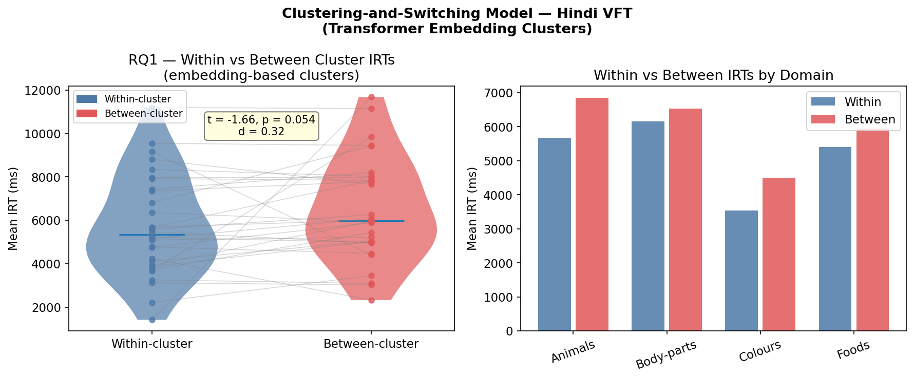
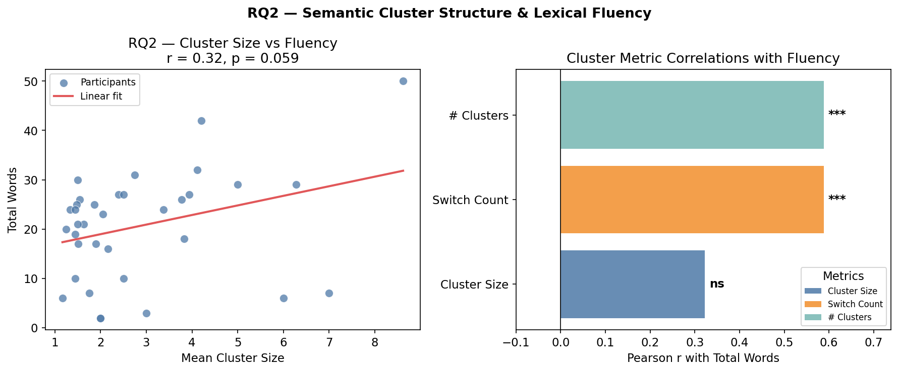
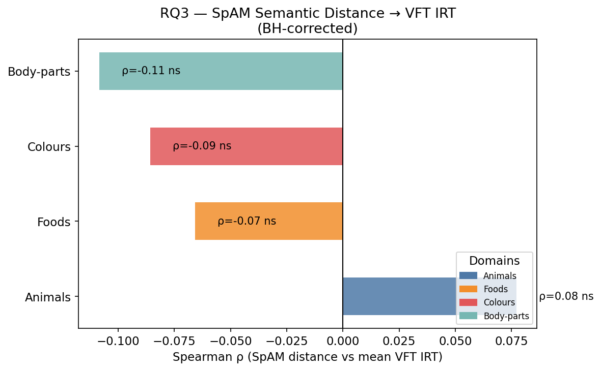
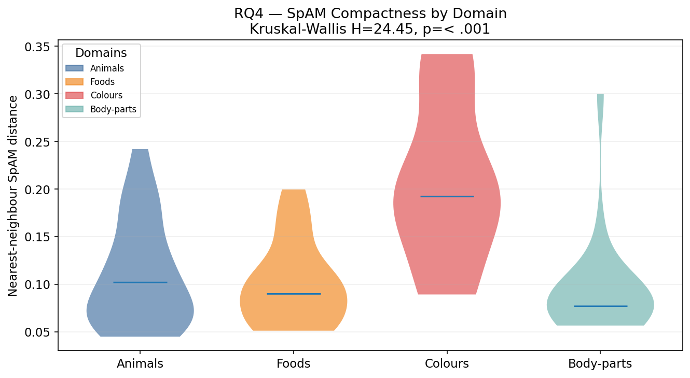
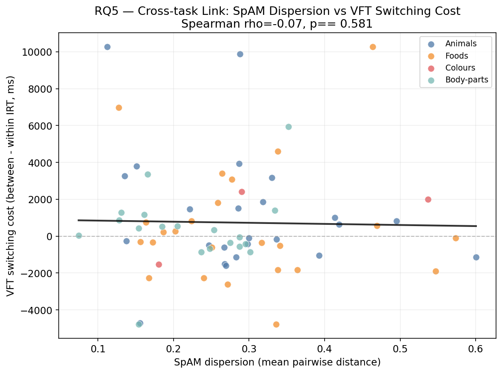
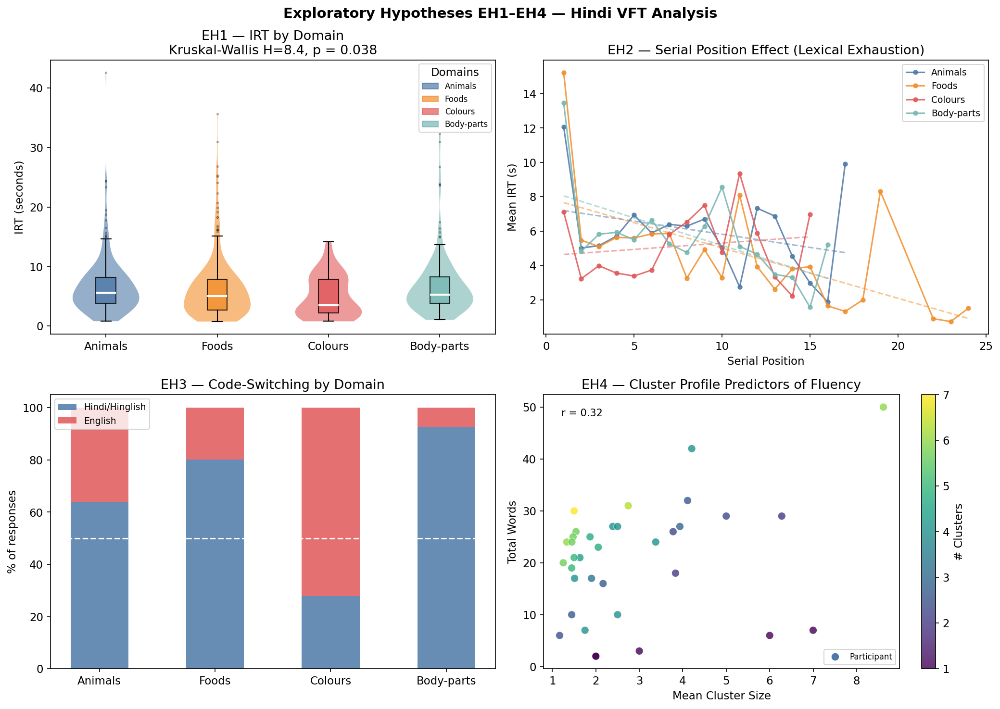
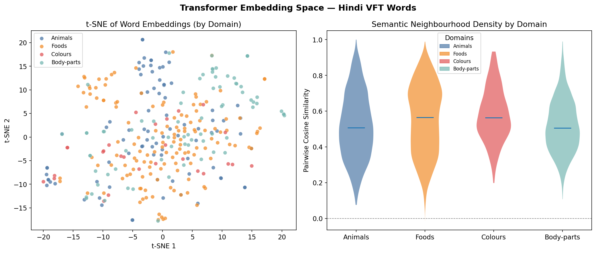
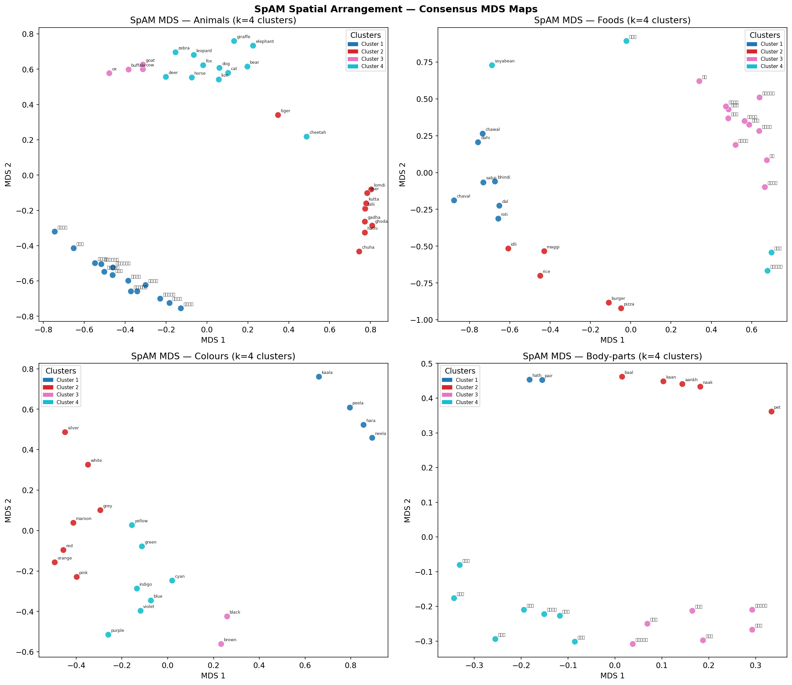

# Background and Information

## Verbal Fluency and SpAM Context

The verbal fluency task asks participants to type category words in limited time.
SpAM asks participants to place words in 2D space based on semantic similarity.
This project combines both tasks in Hindi.

Main goal is to check if semantic structure from SpAM is reflected in retrieval timing from VFT.

## Research Questions and Plain Meaning

This section combines RQ list and simple meaning in one place.

\begin{table}[H]
\centering
\small
\begin{tabular}{p{1.2cm} p{7.6cm} p{4.2cm}}
\\toprule
Item & Formal question & Plain meaning \\
\midrule
RQ1 & Is within-cluster IRT different from between-cluster IRT? & Is switching slower than staying in same cluster? \\
RQ2 & Does mean cluster size predict total fluency? & Do bigger clusters give more words? \\
RQ3 & Does SpAM distance relate to VFT IRT? & Do SpAM distances match VFT timing? \\
RQ4 & Is SpAM compactness different across domains? & Is semantic compactness same in all domains? \\
RQ5 & Does participant-level SpAM dispersion predict VFT switching cost? & Does person-level SpAM spread explain switch cost? \\
EH1 & Do IRT distributions differ across domains? & Is timing different across domains? \\
EH2 & Does serial position affect IRT? & Does later response position change timing? \\
EH3 & Does code-switching pattern differ by domain? & Does Hindi-English mix change by domain? \\
EH4 & Which cluster metric is most related to fluency? & Which cluster metric helps fluency most? \\
\bottomrule
\end{tabular}
\end{table}

## Previous Work and Study Position

Previous VFT work mainly focuses on clustering and switching.
Most studies are in English and western language settings.
Hindi data with script mixing and code-switching is less studied.

SpAM work gives direct semantic layout from participant judgments.
This is useful because it gives a second view of semantic structure.
Our work combines VFT timing and SpAM distance in same participant sample.

Troyer et al. showed clustering and switching as two key parts of fluency behavior.
Hills et al. explained retrieval with optimal foraging view in semantic memory.
Hout et al. showed SpAM as a useful method for semantic similarity mapping.
Bhatt et al. studied bilingual South Asian adults and showed language background
can change verbal fluency output and timing pattern.

Kumar, Lundin and Jones (PsyArXiv 2bazx) showed that semantic and phonological
information jointly affect retrieval in semantic fluency.
Dautriche et al. (2016) showed in 100 languages that semantically similar words are
often more phonologically similar also.

These past studies support our design choice to combine semantic structure and
retrieval timing in one analysis pipeline.

# Experiment

## Participants and Design

This is within-subject design.
Each participant completed all four domains.

- N: 35
- Domains: animals, foods, colours, body-parts
- Hindi-only rows used for core analysis: 723
- All-language rows used for EH3 comparison only: 1040
- Main timing variable: rt_ms

## Procedure Summary

1. Participants typed category words in VFT with timestamp logging.
2. Same participants completed SpAM by placing words on canvas.
3. Processing was done domain-wise for both tasks.

# Data

## VFT Data Processing

1. Kept valid rows and valid rt_ms values.
2. Filtered to Hindi/Hinglish responses for core VFT and cross-task inferential analysis.
3. Used final language labels directly from merged_vft_spam_responses.csv.
4. Built within-cluster and between-cluster means by participant and domain.
5. Computed total fluency and cluster metrics.
6. Built domain-wise summary tables.

## SpAM Data Processing

1. Extracted x and y coordinates from merged_vft_spam_responses.csv.
2. Built participant-wise euclidean distance matrices.
3. Built consensus matrix by averaging valid pair distances.
4. Computed compactness using nearest neighbour distance.
5. Computed participant-level dispersion using mean pairwise distance.

# Methodology

## Normality First Test Selection

We used Shapiro Wilk normality check before choosing tests.

- If p >= 0.05 then parametric test is possible.
- If p < 0.05 then non parametric test is used.

Most key variables were non normal.
So non parametric tests were primary in final inference.

All inferential tests in this report use Hindi/Hinglish-only rows.
EH3 language mix is descriptive comparison and not a significance test.

## Transformer Method: What and How

Transformer model used:

- sentence-transformers/paraphrase-multilingual-MiniLM-L12-v2

How we used it:

1. Generated embeddings for words in each domain.
2. Computed cosine similarity and cosine distance between word pairs.
3. Built neighbourhood density feature from nearest semantic neighbors.
4. Tested neighbourhood density relation with rt_ms using mixed model.

Why this helps:

This gives model-based semantic closeness.
Then we compare this with human behavior timing.
So we get computational and behavioral semantic views together.

## Test Justification Table

\begin{table}[H]
\centering
\small
\begin{tabular}{p{1.2cm} p{3.4cm} p{4.1cm} p{2.5cm} p{3.7cm}}
\\toprule
Item & Quantity tested & Data characteristics observed & Test used & Reason for test choice \\
\midrule
RQ1 & Within vs between cluster IRT (same participant) & Paired values, non-normal paired differences, unequal spread & Wilcoxon signed-rank & Robust paired test without normality assumption; matches within-subject design. \\
RQ2 & Mean cluster size vs total words & Continuous variables, monotonic trend, non-normal residual pattern & Spearman correlation & Rank-based association is stable under skew and outliers; no linear-normal assumption needed. \\
RQ3 & SpAM distance vs VFT IRT by word-pairs & Pairwise distances and timings were skewed and heteroscedastic & Spearman correlation (+ BH correction) & Rank correlation handles non-normal pair-level data; BH controls multiple-domain false discovery. \\
RQ4 & SpAM nearest-neighbour distance across domains & More than two independent domain groups; non-normal compactness values & Kruskal-Wallis + BH-corrected Mann-Whitney & Non-parametric omnibus and post-hoc comparison for multi-group skewed distributions. \\
RQ5 & SpAM dispersion vs switching cost & Correlated repeated observations per participant across domains & Spearman + MixedLM & Spearman gives robust global link; MixedLM models participant-level dependence explicitly. \\
EH1 & IRT differences across domains & Strong right-skew in domain-wise IRT distributions & Kruskal-Wallis & Suitable non-parametric domain comparison under skew. \\
EH2 & Position effect on IRT & Repeated responses nested within participant and domain & Mixed model + domain slopes & Handles repeated-measures dependency and allows domain-specific slope interpretation. \\
EH3 & Hindi vs English usage by domain & Count/proportion pattern with domain imbalance & Descriptive proportion analysis & Objective is usage pattern description; inference test not required for this exploratory check. \\
EH4 & Cluster metrics vs fluency & Metric distributions mostly non-normal with monotonic relations & Spearman correlation & Robust association estimate for skewed metric distributions. \\
\bottomrule
\end{tabular}
\end{table}

# Hypothesis Testing

## RQ1: Within-cluster vs Between-cluster IRT

- Test: Wilcoxon signed rank
- W = 147.0
- p = 0.0402
- Decision: Significant

Interpretation:
Switching is significantly slower than staying within cluster.
So RQ1 is supported in this final merged-data run.

{ width=88% }

Plot interpretation:
The between-cluster IRT distribution is shifted to slower values than within-cluster IRT.
Some overlap is present, but the central tendency remains higher for switching points.
This visual pattern agrees with the significant Wilcoxon result and supports switching cost.

## RQ2: Mean Cluster Size vs Total Fluency

- Test: Spearman correlation
- rho = 0.300
- p = 0.0804
- Decision: Not significant

Interpretation:
Positive trend exists but does not reach 0.05 significance.
So RQ2 is not supported in this final merged-data run.

{ width=88% }

Plot interpretation:
The fitted trend is positive, so larger mean cluster size generally aligns with higher total fluency.
However, point spread is wide and uncertainty is high across participants.
So the plot supports a weak positive trend, not a strong significant effect.

## RQ3: SpAM Distance vs VFT IRT

- Test: Spearman correlation
- Overall rho = -0.047
- Overall p = 0.4031

Domain-wise values:

- Animals: rho = 0.077, p = 0.407
- Foods: rho = -0.066, p = 0.506
- Colours: rho = -0.086, p = 0.872
- Body-parts: rho = -0.108, p = 0.312

Interpretation:
No strong cross-task relation was found in Hindi-only run.
All domain-wise relations are weak and non significant.

{ width=82% }

Plot interpretation:
Most domain-wise trends are close to flat and no domain shows a strong monotonic pattern.
Visual separation by domain is small relative to within-domain scatter.
This matches the weak and non-significant cross-task association in the statistics.

## RQ4: SpAM Compactness Across Domains

- Test: Kruskal Wallis
- H = 24.45
- p < .001

Post hoc after BH correction:

- Colours differs from animals foods and body-parts
- animals vs foods is not significant
- animals vs body-parts is not significant
- foods vs body-parts is not significant

Interpretation:
Semantic compactness is domain dependent.
Colours has clearly different compactness profile.
This supports domain-specific semantic organization.

{ width=82% }

Plot interpretation:
Compactness distributions differ across domains rather than overlapping fully.
The colours domain is visibly separated, while animals, foods, and body-parts are relatively closer.
This visual pattern is consistent with the significant Kruskal-Wallis and post-hoc findings.

## RQ5: SpAM Dispersion vs VFT Switching Cost

- Test: Spearman and MixedLM
- Spearman rho = -0.067 p = 0.5806
- MixedLM beta = -1248.3 p = 0.7101
- Decision: Not significant

Interpretation:
Participant-level SpAM spread does not explain switching cost.
So higher map spread does not imply higher switch penalty.

{ width=82% }

Plot interpretation:
The scatter pattern has high spread and no stable directional structure.
At similar dispersion values, switching cost varies substantially across participants.
This supports the non-significant Spearman and MixedLM results.

# Exploratory Hypotheses

## EH1: Domain-Level IRT Differences

- Test: Kruskal Wallis
- H = 8.409 p = 0.0383

Interpretation:
Domain-wise timing difference is significant in corrected run.
So domain effect on timing is supported.

## EH2: Serial Position Effect

 - Mixed model global p = 0.2936 (not significant)
- Domain slopes significant in animals foods body-parts
- Colours slope not significant

Interpretation:
Global position effect is not significant but domain-specific slopes appear in some domains.
Serial dynamics are domain dependent.

## EH3: Code-Switching Pattern

- Animals: Hindi 63.8%, English 36.2%
- Foods: Hindi 80.1%, English 19.9%
- Colours: Hindi 27.9%, English 72.1%
- Body-parts: Hindi 92.7%, English 7.3%

Interpretation:
Language switching depends on domain context.
It is not random across categories.
Colours shows the strongest shift to English.
One practical reason is lexical exhaustion.
Hindi colour list is smaller than open domains like foods and animals.
After common Hindi colour words are used participants switch to English colour words.

## EH4: Cluster Metrics vs Fluency

- Mean cluster size rho = 0.300 p = 0.0804
- Mean switches rho = 0.588 p = 0.0002
- Mean number of clusters rho = 0.588 p = 0.0002

Interpretation:
Switch count and number of clusters show strong positive relation with fluency.
Mean cluster size shows only a positive trend in this run.

{ width=92% }

Plot interpretation:
The panel combines timing and cluster-metric evidence.
Domain timing distributions show shape differences, confirming domain sensitivity.
Switch-based metrics track fluency more clearly than cluster-size-only metric, which appears weaker.

# Transformer and Semantic Visual Analysis

## Embedding Visuals

These plots show semantic structure learned by transformer embeddings.

{ width=90% }

Plot interpretation:
Embedding plots show non-random neighborhood structure, with meaningful local grouping of words.
Similarity patterns indicate that semantic closeness is captured in vector space.
This supports using transformer features as a computational semantic reference for behavioral analysis.

## SpAM Spatial Visuals

These plots show consensus semantic maps from participant placements.

{ width=88% }

Plot interpretation:
Consensus SpAM maps show domain-specific spatial organization, not one uniform geometry.
Some domains appear tighter and others more dispersed, indicating different semantic compactness levels.
This aligns with the significant domain effect found for compactness.

# Summary Table

\begin{table}[H]
\centering
\small
\begin{tabular}{p{1.2cm} p{3.0cm} p{2.6cm} p{2.3cm} p{5.5cm}}
\\toprule
Item & Test & Statistic & p-value & Decision and interpretation \\
\midrule
RQ1 & Wilcoxon signed-rank & W = 147.0 & 0.0402 & Significant; switching is slower than within-cluster retrieval. \\
RQ2 & Spearman correlation & rho = 0.300 & 0.0804 & Not significant; positive trend but not reliable at 0.05. \\
RQ3 & Spearman correlation & rho = -0.047 & 0.4031 & Not significant; weak cross-task relation in Hindi-only run. \\
RQ4 & Kruskal-Wallis & H = 24.45 & < .001 & Significant; semantic compactness differs by domain, strongest difference in colours. \\
RQ5 & Spearman + MixedLM & rho = -0.067; beta = -1248.3 & 0.5806; 0.7101 & Not significant; participant SpAM spread does not explain switch cost. \\
EH1 & Kruskal-Wallis & H = 8.409 & 0.0383 & Significant domain-wise timing difference. \\
EH2 & MixedLM + domain slopes & global p = 0.2936 & 0.2936 & Global effect not significant; domain-specific slopes present. \\
EH3 & Domain proportion comparison & Hindi/English shares by domain & Descriptive & Clear domain-dependent code-switching pattern, especially colours. \\
EH4 & Spearman correlation & rho = 0.588 (switches/clusters) & 0.0002 & Significant for switching metrics; mean cluster size alone not significant. \\
\bottomrule
\end{tabular}
\end{table}

# Discussion

This final analysis follows strict normality-first test selection.
That keeps statistical decisions consistent.

Supported findings are RQ1 and RQ4.
Not supported findings are RQ2 RQ3 and RQ5.

Main practical story is:

1. Switching cost pattern is reliable in this final merged-data run.
2. Cross-task SpAM-VFT relation is weak in Hindi-only run.
3. Domain effects are strongest in timing compactness and language mix.
4. Transformer semantics and human semantic arrangement both show domain dependence.
5. Plot patterns support this clearly: RQ1 box plots show slower switch points and EH3 domain percentages show strong language shift in colours.

# Conclusion

This final report gives one complete picture from VFT and SpAM together.
Methodology stayed consistent with normality-first test selection.
This improves reliability of inference.

From confirmatory questions:

1. RQ1 is supported and shows reliable within-vs-between switching effect.
2. RQ4 is supported and confirms domain-wise compactness difference.
3. RQ2 is not supported in final merged-data run.
4. RQ3 and RQ5 are not supported in this sample.

From exploratory checks:

1. Domain effect on timing is significant.
2. Global serial position effect is not significant, but some domains show slopes.
3. Code-switching behavior is domain specific.
4. Switch-based cluster metrics are strongly linked with fluency.

Overall meaning in simple words is this.
Hindi semantic retrieval is structured and domain dependent.
SpAM and VFT together give a useful combined view.
Transformer-based semantic features and human semantic judgments both support this.

# References

\begin{thebibliography}{9}

\bibitem{troyer1997}
Troyer, A. K., Moscovitch, M., and Winocur, G. (1997).
Clustering and switching as two components of verbal fluency.
  \textit{Neuropsychology}, \textit{11}(1), 138-146.

\bibitem{hills2012}
Hills, T. T., Jones, M. N., and Todd, P. M. (2012).
Optimal foraging in semantic memory.
  \textit{Psychological Review}, \textit{119}(2), 431-440.

\bibitem{hout2013}
Hout, M. C., Goldinger, S. D., and Ferguson, R. W. (2013).
The versatility of SpAM.
  \textit{Journal of Experimental Psychology: General}, \textit{142}(1), 256-281.

\bibitem{benjamini1995}
Benjamini, Y., and Hochberg, Y. (1995).
Controlling the false discovery rate.
  \textit{Journal of the Royal Statistical Society: Series B}, \textit{57}(1), 289-300.

\bibitem{bhatt2022}
Bhatt, R., Anderson, N. D., and Bhatt, M. (2022).
Verbal fluency in bilingual South Asian older adults.
  \textit{Journal of the International Neuropsychological Society}, \textit{28}(4), 412-421.

\bibitem{kumar2022}
Kumar, A., Lundin, N. B., and Jones, M. N. (2022).
Mouse-Mole-Vole: The Inconspicuous Benefit of Phonology During Retrieval from Semantic Memory.
  \textit{PsyArXiv}. DOI: 10.31234/osf.io/2bazx.

\bibitem{dautriche2016}
Dautriche, I., Mahowald, K., Gibson, E., and Piantadosi, S. T. (2016).
Wordform Similarity Increases With Semantic Similarity: An Analysis of 100 Languages.
  \textit{Cognitive Science}, 1-21. DOI: 10.1111/cogs.12453.

\end{thebibliography}

