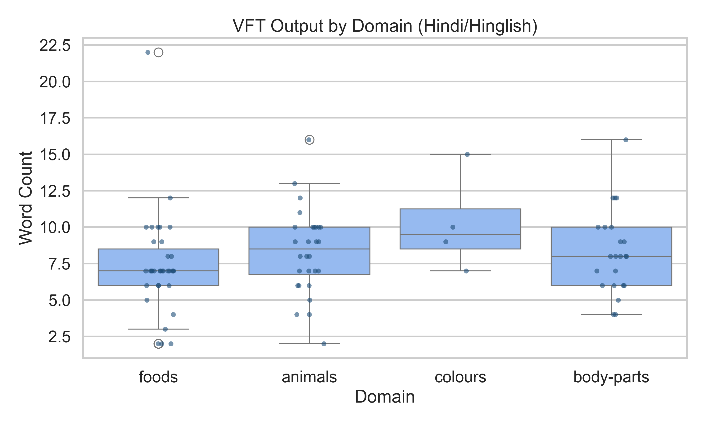
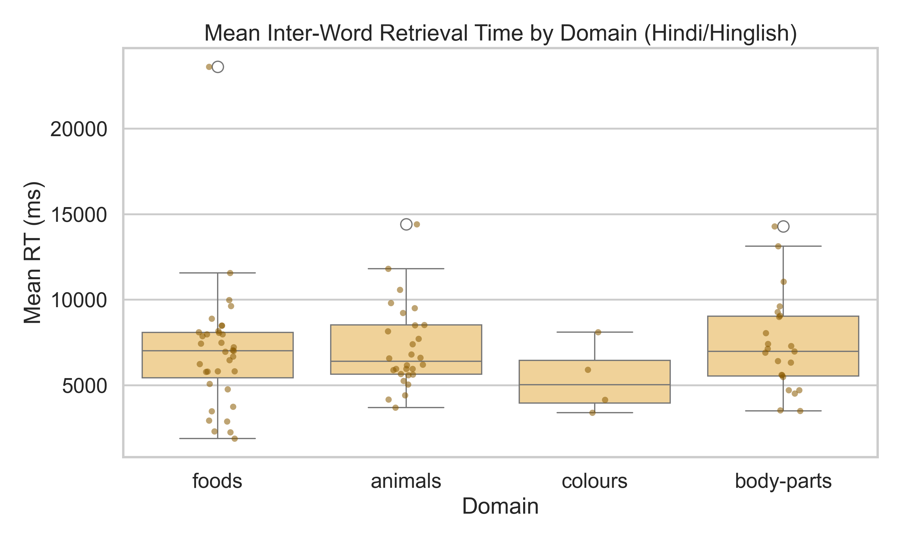
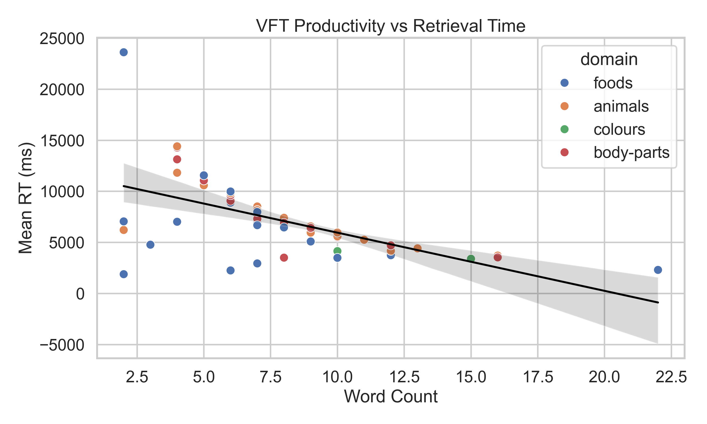
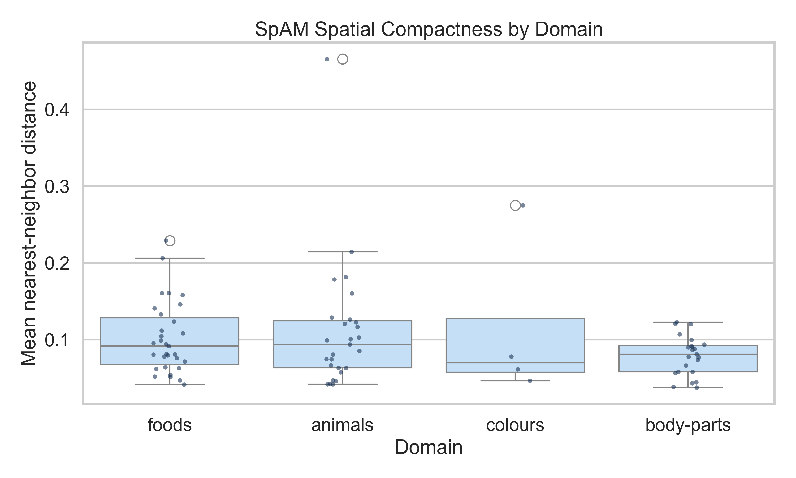
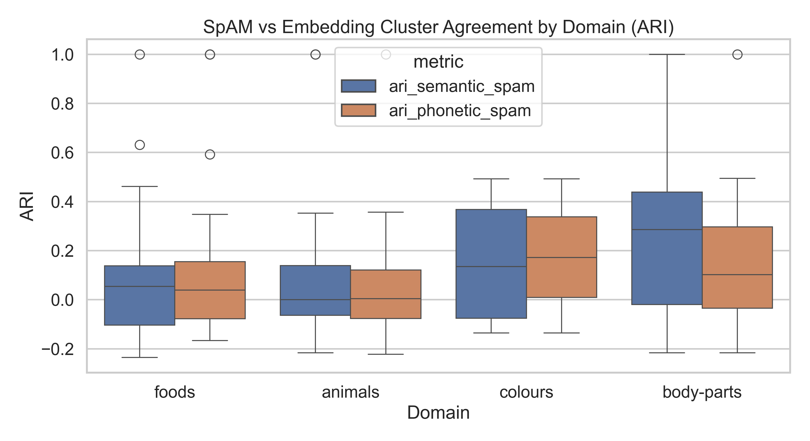
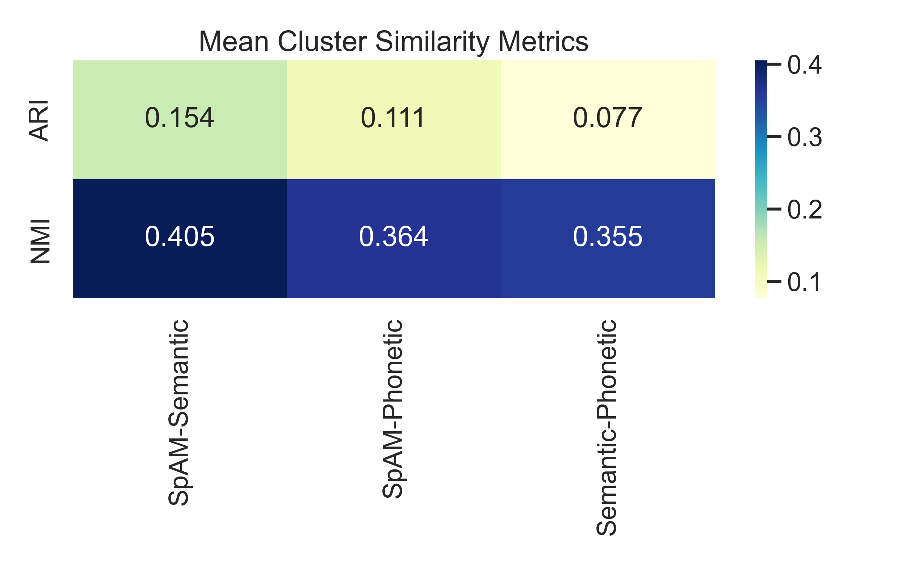
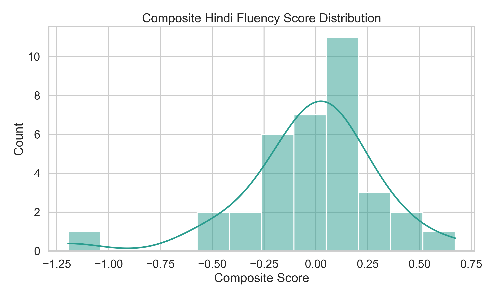
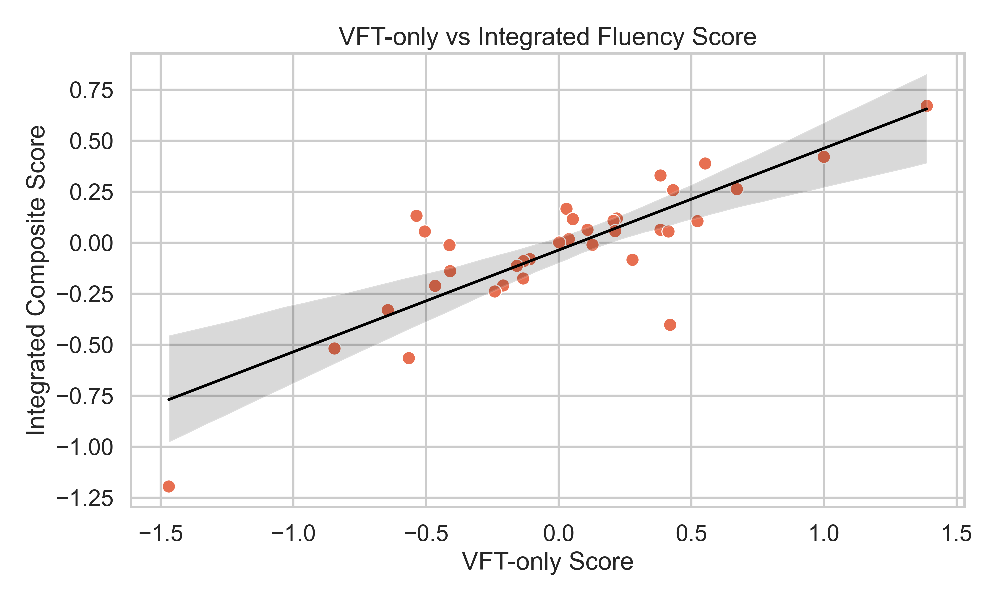
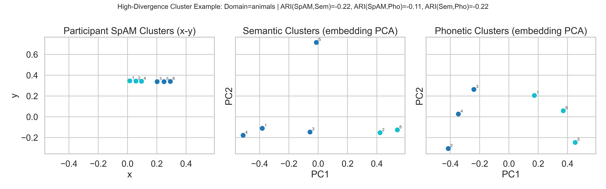

# Report_Final

## 1. Background and Context
This report analyzes Hindi fluency experiment data containing two core tasks from the brief: Verbal Fluency Task (VFT) and Spatial Arrangement Method (SpAM). The objective is to answer the main research question using methods constrained to BRSM syllabus coverage, while keeping English entries as comparison context only.

Dataset overview (post trial exclusion):
- Sessions: 35
- Participants (subject IDs): 35
- Domains: animals, body-parts, colours, foods
- Language rows: {'hindi/hinglish': 723, 'english': 317}
- Primary analysis subset (Hindi/Hinglish): 723 / 1040 rows (69.5%)

## 2. Research Question
Verbatim from the brief: "How do Hindi speakers search their mental lexicons for information?" [1]

## 3. Data and Preprocessing
- Source files used: processed CSV [3], raw JSON [4], experiment brief [1], BRSM syllabus summary [2].
- Trial run exclusion: furniture-practice/furniture rows were excluded if present (none were present in processed CSV).
- Primary inferential analyses used only Hindi/Hinglish rows.
- English rows were retained only for descriptive comparison.
- Session-domain unit was used for VFT and SpAM feature extraction.
- Missingness check: rt_ms, x, y had no missing values in processed CSV.

### Descriptive Snapshot by Domain (Hindi/Hinglish)
| domain     |   n_session_domain |   mean_word_count |   sd_word_count |   mean_rt_ms |   mean_lexical_diversity |
|:-----------|-------------------:|------------------:|----------------:|-------------:|-------------------------:|
| colours    |                  4 |            10.25  |           3.403 |      5392.52 |                    0.914 |
| animals    |                 28 |             8.321 |           2.932 |      7196.57 |                    0.996 |
| body-parts |                 23 |             8.304 |           2.883 |      7384.59 |                    0.995 |
| foods      |                 35 |             7.371 |           3.465 |      6978.33 |                    1     |

### English Comparison Context (Descriptive Only)
| domain     |   english_rows |   english_mean_rt_ms |
|:-----------|---------------:|---------------------:|
| animals    |            132 |              3377.41 |
| colours    |            106 |              3534.64 |
| foods      |             64 |              5066.63 |
| body-parts |             15 |              3392.87 |

Interpretation:
- Hindi/Hinglish rows dominate the dataset, enabling primary testing without relying on English entries.
- Domain-level variation in both word output and retrieval speed is visible prior to formal testing.

## 4. Task Definition: VFT and SpAM
- VFT: participants produced as many category-relevant words as possible within one minute.
- SpAM: participants arranged produced words spatially by perceived similarity using x-y placement.

Operationalization in this report:
- VFT outcomes: word count, lexical diversity, mean RT.
- SpAM outcomes: nearest-neighbor distance, participant-cluster structure from x-y, and agreement with semantic/phonetic clustering.

## 5. Hypotheses and Exploratory Objectives
Confirmatory hypotheses:
1. VFT performance differs across domains (normality-first domain comparison).
2. Retrieval speed differs across domains (normality-first domain comparison).
3. SpAM spatial cohesion differs across domains (normality-first domain comparison).
4. SpAM-embedding agreement is more often positive than non-positive (binomial sign test).

Exploratory objectives:
1. Identify strongest participant-level associations between VFT metrics and Hindi fluency background indicators.
2. Quantify semantic vs phonetic cluster agreement with participant SpAM clusters.
3. Evaluate whether integrating SpAM features with VFT improves fluency alignment over VFT-only scoring.

## 6. Methods (syllabus-aligned)
Inferential tests were selected by a normality-first decision rule using Shapiro-Wilk checks [2]:
- If group-wise normality and variance homogeneity held, one-way ANOVA was used for domain comparisons.
- If assumptions failed, Kruskal-Wallis was used for domain comparisons.
- For pairwise associations, Pearson was used when both variables were normal; otherwise Spearman rank correlation was used.
- Binomial sign test was used for directional tendency of positive alignment metrics.

Similarity metrics (ARI, NMI) were used as quantitative cluster-agreement measures. Semantic and phonetic embeddings were generated with Hugging Face sentence-transformer models (`sentence-transformers/paraphrase-multilingual-MiniLM-L12-v2`) on original and phonetic-key text respectively.

## 7. Results: VFT
### Domain Difference Tests
- Normality assumptions were not fully satisfied; Kruskal-Wallis indicates not statistically significant domain-level differences in vft word count (H=5.295, p=0.1515, epsilon^2=0.027).
- Normality assumptions were not fully satisfied; Kruskal-Wallis indicates not statistically significant domain-level differences in vft mean rt (H=1.919, p=0.5894, epsilon^2=-0.013).

### Association Analysis (Session-Level Spearman)
| metric      | target   | test_used   |    rho |     p |
|:------------|:---------|:------------|-------:|------:|
| total_words | hi_conf  | Spearman    | -0.395 | 0.019 |

Interpretation:
- VFT domain-comparison tests were not statistically significant, so domain differences should be interpreted as descriptive trends in this sample.
- Significant correlations identify participant characteristics linked to VFT outcomes.

## 8. Results: SpAM
### Domain Difference Test
- Normality assumptions were not fully satisfied; Kruskal-Wallis indicates not statistically significant domain-level differences in spam nearest-neighbor distance (H=3.038, p=0.3857, epsilon^2=0.000).

### SpAM Structure and Consistency Summary
| domain     |   mean_ari_semantic_spam |   mean_ari_phonetic_spam |   mean_nmi_semantic_spam |   mean_nmi_phonetic_spam |   mean_nn_distance |
|:-----------|-------------------------:|-------------------------:|-------------------------:|-------------------------:|-------------------:|
| body-parts |                    0.316 |                    0.162 |                    0.49  |                    0.34  |              0.079 |
| colours    |                    0.157 |                    0.175 |                    0.301 |                    0.319 |              0.115 |
| animals    |                    0.095 |                    0.064 |                    0.394 |                    0.384 |              0.111 |
| foods      |                    0.086 |                    0.106 |                    0.364 |                    0.37  |              0.102 |

Interpretation:
- SpAM structure varies across domains, suggesting domain-specific cognitive organization patterns.
- Mean nearest-neighbor distance provides a compact measure of spatial packing/cohesion.

## 9. Results: Cross-Task Integration (VFT + SpAM)
Sign tests on alignment tendency:
- Sign test on semantic-SpAM ARI: 48/78 positive; p=0.0268. Evidence favors positive alignment.
- Sign test on phonetic-SpAM ARI: 48/79 positive; p=0.0356. Evidence favors positive alignment.

Interpretation:
- At least one sign test supports predominantly positive SpAM-embedding alignment, suggesting systematic structure linkage.
- Cross-task evidence (VFT + SpAM) provides richer fluency signal than VFT alone.

## 10. Results: Clustering and Similarity Metrics
Domain-level cluster-comparison metrics are shown above and in the figures.

Key global means:
- Mean ARI (SpAM vs Semantic): 0.154
- Mean ARI (SpAM vs Phonetic): 0.111
- Mean NMI (SpAM vs Semantic): 0.405
- Mean NMI (SpAM vs Phonetic): 0.364

Interpretation:
- Semantic and phonetic representations both capture part of participant organization, with varying domain sensitivity.
- Mismatch cases are informative and indicate non-trivial strategy differences in lexical organization.

## 11. Composite Hindi Fluency Score (equal domain weights)
Scoring design:
- Domain-level score used equal weighting across domains by averaging standardized components per session-domain.
- Components: VFT productivity, lexical diversity, retrieval efficiency, spatial cohesion, semantic alignment, phonetic alignment.
- Participant composite score: arithmetic mean of domain-level scores across available domains (equal domain contribution).

Top participants by integrated score:
| session_id           |   subject_id |   composite_fluency_score |   vft_only_score |   domains_covered |
|:---------------------|-------------:|--------------------------:|-----------------:|------------------:|
| 7fxWA2O6NjFEe7m2ElN6 |        92821 |                     0.672 |            1.388 |                 3 |
| 7qcl9kAGwA6XevJ63fN5 |        73233 |                     0.422 |            0.999 |                 3 |
| snaeryp1qDdm9U2aEtz8 |        43909 |                     0.389 |            0.552 |                 3 |
| 1qmxoH7jT7VECeLUVEKU |        10255 |                     0.33  |            0.384 |                 1 |
| fKK8hvwEtgEfWDEZysTz |        81788 |                     0.264 |            0.671 |                 1 |

VFT-only vs integrated score relation:
- Spearman rho(VFT-only, hi_confidence) = -0.449, p=0.0069
- Spearman rho(Integrated, hi_confidence) = -0.317, p=0.0633

Interpretation:
- The integrated score incorporates both lexical retrieval and organization structure, aligning with the dual-task design.
- In this dataset, integrated scoring did not outperform VFT-only association with Hindi confidence, though it captures complementary structure-based information.

## 12. Discussion and Interpretation
Main synthesis:
- VFT results support structured, domain-sensitive lexical retrieval rather than uniform random retrieval.
- SpAM analyses show that participant similarity layouts carry measurable structure.
- Semantic/phonetic cluster comparisons suggest that lexical search reflects both meaning-level and sound-level organization.
- Combined task evidence provides a broader proxy for Hindi fluency than single-task metrics.

Implication for the core research question:
- Hindi speakers appear to search mental lexicons using structured neighborhood mechanisms that are visible in both retrieval dynamics (VFT) and similarity organization (SpAM), with domain-dependent variation.

## 13. Conclusion answering the main research question
Answer: The evidence indicates that Hindi speakers do not retrieve words randomly. Instead, retrieval shows domain-dependent structured search, and participant similarity arrangements align non-trivially with semantic and phonetic organization. This supports the view that Hindi lexical search relies on organized mental neighborhoods, observable through both VFT output dynamics and SpAM spatial grouping.

## 14. Limitations and Future Work
- The processed CSV was the main computational source; raw JSON was used for structure validation and task-trace context.
- Sample size is moderate (35 sessions), so subgroup analyses may be underpowered.
- Phonetic encoding used a lightweight transliteration heuristic; richer Hindi phonology models may improve alignment estimates.
- Future work: bootstrap stability intervals for alignment metrics and replicate with larger balanced cohorts.

## 15. References (verifiable citations only)
[1] hindi fluency experiment brief_ BRSM 2026.pdf
[2] BRSM-Syllabus.md
[3] merged_vft_spam_responses_enriched.csv
[4] responses.json

## 16. Figure Interpretation Guide
1. `images/vft_wordcount_by_domain.png`: Domain-wise spread of VFT output size (word count) for Hindi/Hinglish trials. Wider spread indicates stronger participant heterogeneity.
2. `images/vft_rt_by_domain.png`: Domain-wise spread of mean inter-word retrieval time. Higher values indicate slower lexical retrieval.
3. `images/vft_words_vs_rt.png`: Productivity-speed tradeoff view. Downward relation suggests participants producing more words tend to retrieve faster.
4. `images/spam_compactness_by_domain.png`: SpAM spatial compactness by domain using mean nearest-neighbor distance. Lower values indicate tighter semantic packing in participant maps.
5. `images/spam_alignment_by_domain.png`: Domain-wise ARI distributions for SpAM vs semantic and SpAM vs phonetic clusters. Higher ARI means stronger cluster-label agreement.
6. `images/cluster_similarity_matrix.png`: Global mean ARI/NMI summary across comparison pairs. NMI reflects shared information, ARI reflects strict partition agreement.
7. `images/composite_score_distribution.png`: Distribution of integrated fluency score across participants. Shape indicates overall spread and central tendency.
8. `images/vft_vs_integrated_score.png`: Relation between VFT-only and integrated scores. Closer fit to line indicates stronger monotonic coupling.
9. `images/sample_spam_semantic_phonetic_clusters.png`: Three views of one high-divergence participant-domain case.
    - Left panel: participant SpAM coordinates (`x,y`) clustered from manual arrangement.
    - Middle panel: semantic embedding space (PCA projection) clustered by KMeans.
    - Right panel: phonetic-key embedding space (PCA projection) clustered by KMeans.
    - Same words are shown in all panels, but geometry differs by method; color indicates cluster label inside each method.
    - Selected a high-divergence participant-domain case to make method differences visible. Domain=animals, n_words=6, k=2, ARI(SpAM,Semantic)=-0.216, ARI(SpAM,Phonetic)=-0.111, ARI(Semantic,Phonetic)=-0.216.
    - Point-to-word mapping: 1:गाय; 2:भैंस; 3:बैल; 4:बकरी; 5:घोड़ा; 6:गधा
    - Point-wise cluster assignments: 1:SpAM1/Sem0/Pho1; 2:SpAM1/Sem1/Pho0; 3:SpAM0/Sem0/Pho0; 4:SpAM1/Sem0/Pho0; 5:SpAM0/Sem0/Pho1; 6:SpAM0/Sem1/Pho1

## Figures
- 
- 
- 
- 
- 
- 
- 
- 
- 
